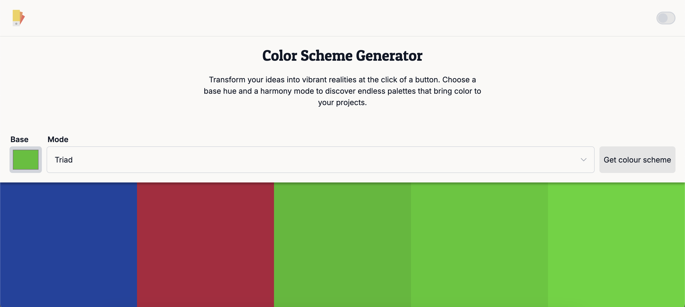

# Color Scheme Generator

[Demo link](https://66d76dd4ef8b87b2ca78bcb0--boisterous-dragon-72fd63.netlify.app/)

The Color Scheme Generator web application lets you generate cohesive color palettes
- Select a base color and a harmony mode to create the theme you want
- Get a visual display of the generated palette along with color details
- Hover over the display to get the details for each color in the palette

# What I have learned

The focus of this project was to practice using API calls, and fetching data to display on a page.
I learned how to deal with basic JavaScript asynchrony, and how to work with dynamically retrieved data.

# What issues have I faced and how I resolved them

[Tell what was hard in the process of building the project. Tell about where have you feel stuck and how did you overcome this.]

**Example:**

I had to create a custom select input with dropdown functionality that could be styled entirely using CSS.
In addition to requiring a lot of JavaScript to implement, this led to several accessibility issues.
Using Google, I was able to remedy some of these issues using aria-label & role attributes, but I will need to spend more time learning about accessibility in practice.