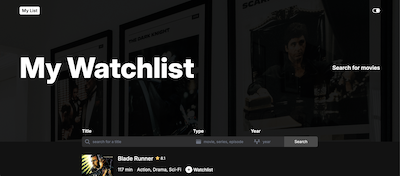

# Movie Watchlist

[Demo](https://66e4a8e77537c4839804103a--glowing-smakager-0284cd.netlify.app)

Movie Watchlist is a web application to plan your watch parties! 
- Enter the title of a movie or series you want to see.
- Get a list of all matching movies and series.
- Select the ones you want to add to your watchlist.
- Review and modify your watchlist as you wish!

# Technologies in use / Tech Stack / Built with

- HTML/CSS/JS
- OMDb API

# What I have learned

While working on the Movie Watchlist I learned the fundamentals of asynchronous Javascript, and how to use the async/await syntax.
I struggled when dealing with asynchronous API calls made inside a for loop. Only after some Googling did I learn about the Promise.all() method from the MDN documentation for handling arrays of Promise instances.

# Source

This project is done as part of the Scrimba Frontend Developer Career Path curriculum.